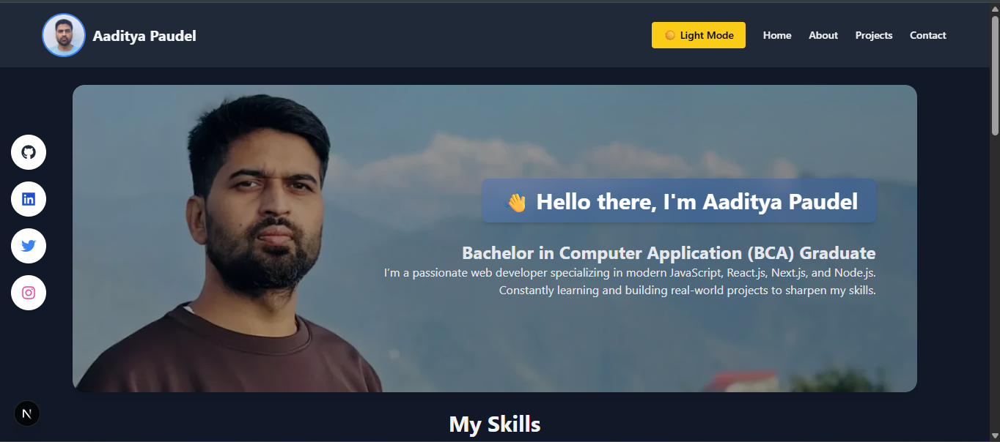
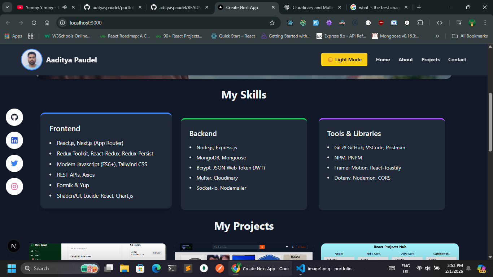
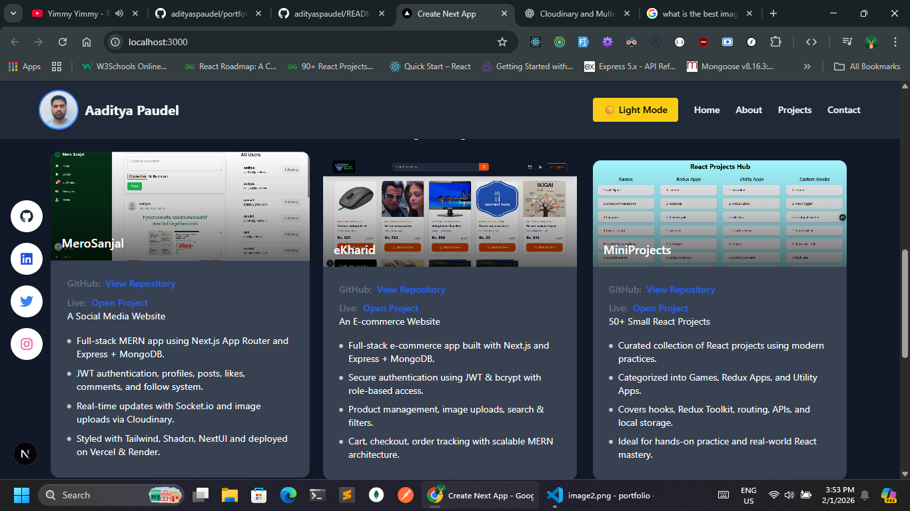
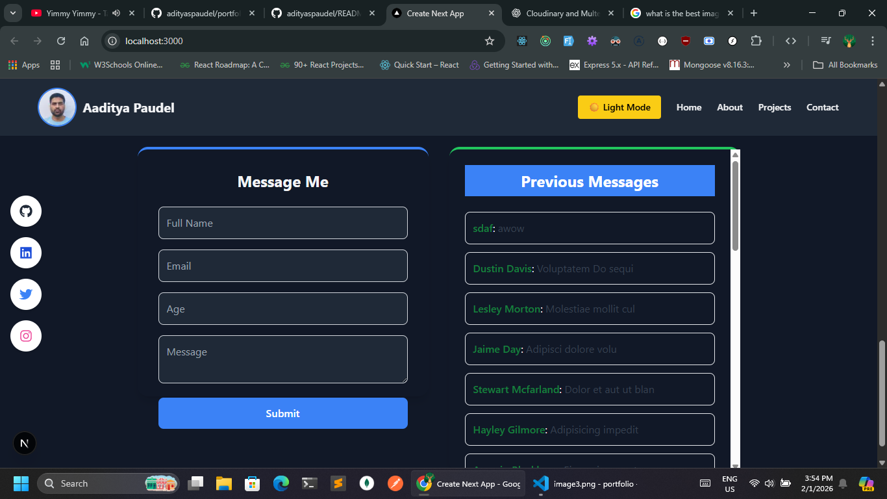

# Portfolio

## Hello there, Iam Aaditya Paudel


# 🚀 Full-Stack Portfolio Website

A modern, high-performance **full-stack portfolio website** built to showcase my projects, skills, and experience using the latest **Next.js + React** frontend stack and a **Node.js + Express + MongoDB** backend.

This project focuses on **clean architecture, scalability, and smooth UI/UX**, following real-world production practices.

---

## ✨ Features

- ⚡ **Next.js App Router** with Turbopack
- 🎨 **Modern UI & Animations** using Tailwind CSS, MUI, Radix UI, and Framer Motion
- 🧠 **Global State Management** with Redux Toolkit + Persist
- 🔔 **Toast Notifications** using React Toastify
- 📱 **Fully Responsive Design**
- 🔐 **REST API Backend** with Express & MongoDB
- 🌍 **Environment Configuration** with dotenv
- 🚀 **Production-ready setup**

---

## 🛠 Tech Stack

### 🖥 Frontend
- **Next.js 16**
- **React 19**
- **Tailwind CSS**
- **Material UI (MUI)** + Emotion
- **Radix UI**
- **Redux Toolkit**
- **Redux Persist & Logger**
- **Framer Motion**
- **Axios**
- **Lucide Icons / React Icons**
- **React Toastify**

### 🧰 Backend
- **Node.js**
- **Express.js**
- **MongoDB**
- **Mongoose**
- **CORS**
- **dotenv**
- **Nodemon**

---

## 📂 Project Structure

### Frontend
```bash
nextjs/
 ├── app/
 ├── components/
 ├── lib/
 ├── public/
 ├── styles/
 ├── tailwind.config.js
 └── package.json

```
### Backend 
```bash

server/
 ├── src/
 │    ├── controllers/
 │    ├── models/
 │    ├── routes/
 │    ├── db/
 │    └── index.js
 ├── .env
 └── package.json
```

## Start Project
```bash

cd nextjs
npm install
npm run dev

````

```bash

cd server
npm install
npm run dev

```

## 📸 Screenshots

### Screenshot1


### Screenshot2


### Screenshot3


### Screenshot4
